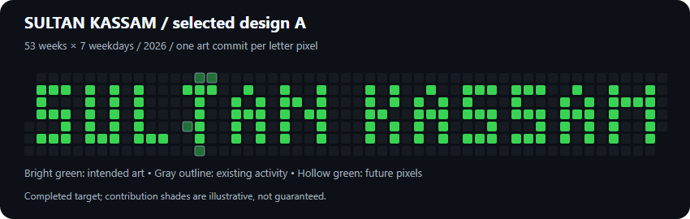
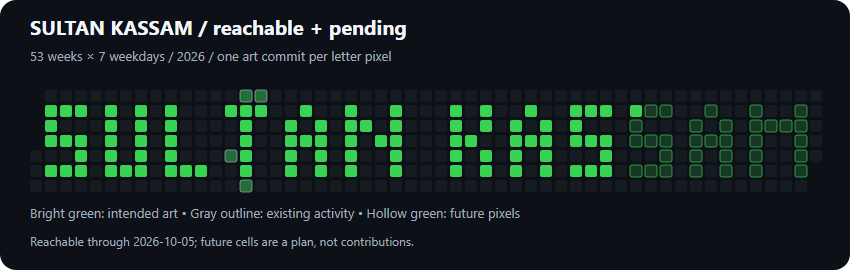

# SULTAN KASSAM / calendar typography

**GitHub contribution graph pixel art / profile experiment.**

These commits paint calendar cells. They do **not** represent software development work, a streak, shipped features or productivity.



## Selected design

A — compact five-row uppercase typography, widened N/M glyphs, one-cell letter spacing, three-cell word spacing and empty Sunday/Saturday rows. 122 intended pixels across a 53 × 7 Sunday-first calendar. The pattern spans columns 1–51 and finishes on 25 December 2026.

Compare [A](design/option-A.png), [B: denser typography](design/option-B.png), and [C: monogram-assisted abbreviation](design/option-C.png). The target preview illustrates the completed design; it does not claim future commits already exist. Exact shades are controlled by GitHub and can change with the contribution distribution.



The reachability preview is a planning snapshot dated 5 October 2026. Bright green marks reachable art, hollow green marks future intended pixels, and gray outlines show existing account activity. Existing contributions cannot be erased by this repository. Setup commits and repository creation may also add activity outside the bitmap.

## Calendar and evidence

- [Exact 53 × 7 bitmap and date map](design/sultan-kassam-grid.json)
- [Readable per-cell mapping](design/mapping.txt)
- [Application state](state.json)
- [Public account calendar baseline](design/baseline-2026.json)

On the audit date, public calendar days with one contribution returned `FOURTH_QUARTILE`, including 30 March 2026. One commit per letter pixel is therefore the minimum visible paint choice. This observation is not a permanent intensity threshold. No extra commits are added simply to darken a pixel.

GitHub attributes qualifying commits using an account-associated author address and the default branch in a standalone repository. Our author address is the user's existing Git configuration, independently confirmed by GitHub's attribution of an existing public commit. Global Git configuration is unchanged. Author dates encode the intended pixel date at 09:00 Africa/Nairobi; committer dates retain actual creation time. Both must be at or before the current instant. [Contribution rules](https://docs.github.com/en/account-and-profile/reference/profile-contributions-reference).

## Date-safe automation

Daily at **09:37 Africa/Nairobi / 06:37 UTC**, the Action checks today's bitmap cell. It appends one labeled commit only if a due pixel has not already been painted. Empty cells do nothing. A repository variable supplies the account-associated author address. Only `contents: write` is requested. No push trigger, force push, rebase or history rewrite is used.

The state file and commit messages must agree. A duplicate, wrong branch, wrong remote, dirty working tree, timestamp in the future or identity mismatch stops application. GitHub Actions schedules can be delayed or missed; manual `catch-up` dispatch recovers only past due dates. The final planned date is **25 December 2026**; the graph remains best viewed through GitHub's **2026 year filter** after completion. The default rolling calendar shifts over time.

## Local commands

Python 3.10+ and Git; generators have no third-party dependencies. Commands must be run from this dedicated checkout with its repository-local account author configured.

```sh
python scripts/generate-pattern.py --today 2026-10-05
python scripts/apply-pattern.py --mode historical --dry-run
python scripts/apply-pattern.py --mode historical --apply
python scripts/apply-pattern.py --mode daily --apply
python scripts/verify-pattern.py
```

Commit messages use `art: pixel YYYY-MM-DD intensity-1`. Re-running application cannot add a second commit for the same date. `historical` and `catch-up` never apply future cells. Image previews are rendered from the generated SVGs; regeneration of PNGs requires a separate SVG/browser renderer and is not part of the daily Action.

## Optional 2025 alternative

[A complete 2025 date plan](design/optional-2025-plan.json) is included for inspection only. It has not been selected or applied. The application script intentionally accepts only the selected 2026 design.

GitHub may take up to 24 hours to reflect qualifying commits. Refresh delay is not a reason to add duplicate paint. [GitHub troubleshooting guidance](https://docs.github.com/en/account-and-profile/how-tos/contribution-settings/troubleshooting-missing-contributions).
